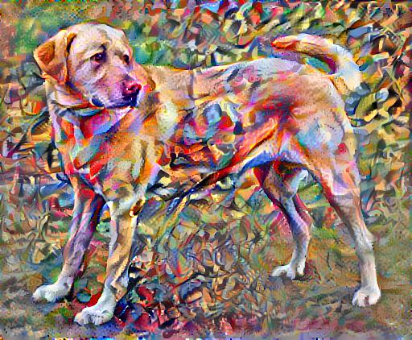

# Neural Style Transfer
Reimplementation of the [Tensorflow Style Transfer Tutorial](https://www.tensorflow.org/tutorials/generative/style_transfer) as a Python module.
The algorithm used in the tutorial is based on the original neural style transfer technique described in [A Neural Algorithm of Artistic Style](https://arxiv.org/abs/1508.06576) (Gatys et al.).


## Usage
```
usage: main.py [-h] --content CONTENT_PATH --style STYLE_PATH --output DEST
               [--content-weight CONTENT_WEIGHT] [--style-weight STYLE_WEIGHT]
               [--tv-weight TV_WEIGHT] [--learning-rate LEARNING_RATE]
               [--epochs EPOCHS] [--len-epoch LEN_EPOCH]

optional arguments:
  -h, --help                         show this help message and exit
  --content CONTENT_PATH             content image path (default: None)
  --style STYLE_PATH                 style image path (default: None)
  --output DEST                      output path (default: None)
  --content-weight CONTENT_WEIGHT    content weight (default: 10000.0)
  --style-weight STYLE_WEIGHT        style weight (default: 0.01)
  --tv-weight TV_WEIGHT              total variation weight (default: 30)
  --learning-rate LEARNING_RATE      learning rate (default: 0.02)
  --epochs EPOCHS                    number of epochs (default: 10)
  --len-epoch LEN_EPOCH              steps per epoch (default: 100)
```


## Example

#### Content Image


#### Style Image


#### Generated Image

